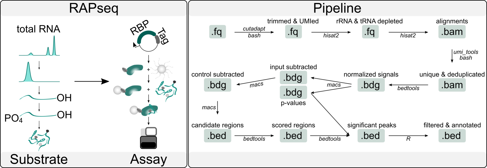

# RAPseq workflow with Snakemake🐍

**RNA Affinity Purification** followed by sequencing (**RAPseq**) is a high-thorughput *in vitro* method for detecting RNA binding protein (RBP)-RNA interactions. In brief, the method uses a recombinant RBP fused to a HaloTag to capture and produce samples enriched for relevant targets from a native RNA substrate, which are then sequenced on a NGS platform. Relevant **RBP-RNA interactions** are determined by comparing the sequencing results of RBP-specific binding assays to the HaloTag-specific and input background. This repository contains the necessary files to run RAPseq analyses on an HPC cluster using the Snakemake workflow engine.

|  |
|:--:|
| ***RAPseq Workflow. Credit to I. Atanasoai*** |

**Citation:**
> Mosca R, Gallardo-Dodd C J, Li Q, Sommerauer C, Šidiškis J, Søndergaard J N, Kutter C. RAPseq enables large-scale identification of RBP-RNA interactions and reveals essentials of post-transcriptional gene regulation. Nucleic Acids Res. 2026.


## Usage

Run the workflow from the `Snakefile` directory or otherwise specify with `-s`. Provide directory with the HPC cluster configuration for Snakemake using `--profile`. Edit the `config.yaml` file according to the requirements of the job scheduler on your HPC cluster.

```shell
$ module load snakemake
$ snakemake --profile ./slurm
```

Check that all required files are available in your working directory (e.g., raw FQ files and reference sequence indexes for alignment).

```shell
$ tree
RAPseq_workflow
├── analyses
├── data
│   ├── fastq_raw
│   │   ├── HALO_R1.fastq.gz
│   │   ├── HALO_R2.fastq.gz
│   │   ├── IGF2BP1_rep1_R1.fastq.gz
│   │   ├── IGF2BP1_rep1_R2.fastq.gz
│   │   ├── IGF2BP1_rep2_R1.fastq.gz
│   │   ├── IGF2BP1_rep2_R2.fastq.gz
│   │   ├── INPUT_R1.fastq.gz
│   │   └── INPUT_R2.fastq.gz
│   ├── genome_ref
│   │   ├── GRCm38.primary_assembly.genome.1.ht2
│   │   ├── GRCm38.primary_assembly.genome.2.ht2
│   │   ├── GRCm38.primary_assembly.genome.3.ht2
│   │   ├── GRCm38.primary_assembly.genome.4.ht2
│   │   ├── GRCm38.primary_assembly.genome.5.ht2
│   │   ├── GRCm38.primary_assembly.genome.6.ht2
│   │   ├── GRCm38.primary_assembly.genome.7.ht2
│   │   ├── GRCm38.primary_assembly.genome.8.ht2
│   │   └── GRCm38.primary_assembly.genome.fa
│   ├── rRNA_tRNA_ref
│   │   ├── rRNAs_tRNAs.1.ht2
│   │   ├── rRNAs_tRNAs.2.ht2
│   │   ├── rRNAs_tRNAs.3.ht2
│   │   ├── rRNAs_tRNAs.4.ht2
│   │   ├── rRNAs_tRNAs.5.ht2
│   │   ├── rRNAs_tRNAs.6.ht2
│   │   ├── rRNAs_tRNAs.7.ht2
│   │   ├── rRNAs_tRNAs.8.ht2
│   │   └── rRNAs_tRNAs.fa
│   └── scales
│       └── scales.tsv
├── pics
│   └── RAPseq_workflow.png
├── outputs
├── scripts
│   └── get_mean_summits.R
└── snakemake
    ├── slurm
    │   └── config.yaml
    └── snakefile
```

To check the different steps of the workflow use:

```shell
$ snakemake -l
all
fastqc_raw
    
    Runs fastqc on raw fq files.
    
trim
    
    Uses cutadapt to trim adapter sequences from raw fq files
    
fastqc_trimmed
    
    Runs fastqc on trimmed fq files.
    
extract_umi
    
    Extracts UMI form first 4nt in R1 and R2 and adds it to header.
    
remove_rRNA_tRNA
    
    Removes rRNA and tRNA mapping reads from fq files.
    
unique_mapping_deduplicated
    
    Aligns reads to reference genome, selects uniquely mapping reads and removes PCR duplicates.
    
get_scaled_bedgraph
    
    Generates scaled genome coverage profiles using a scaling factor relative to the sequencing depth of the HaloTag control library.
    
subtract_HALO_vs_INPUT
    
    Subtracts the HaloTag signal from Input and vice versa.
    
subtract_HALO_INPUT
    
    Subtracts the HaloTag and Input signal from RBP coverage files.
    
call_peaks
    
    Finds candidate regions for RBP-RNA interactions.
    
get_consensus_peaks
    
    Retrieves consensus RBP-RNA interaction regions across replicates.
    
get_pvalues
    
    Calculates p-values measuring signal enrichment in RBP coverage files compared to that of the HaloTag control 
    and while controlling for Input background.
    
get_mean_summits
    
    Calculates summit position of peaks.
    
get_stranded_counts
    
    Retrieves strand-specific counts per peak summit.
    
score_regions
    
    Add scoring information to peak summit files.
    
get_sequences
    
    Retrieves 200nt sequences around peak summits and of control regions 1000nt downstream of these.
```


## Results

The final output is a **BED** file containing the shortlisted candidate regions for RBP-RNA interaction. Each column contains the information as specified:

|Chromosome|Summit Start|Summit End|Peak Start|Peak End|Strand|Rep1 Read Counts|Rep2 Read Counts|Rep1 -log<sub>10</sub>p-value|Rep2 -log<sub>10</sub>p-value|Rep1 Signal|Rep2 Signal|Halo Signal|Input Signal|Target Sequence|Control Sequence|
|:---:|:---:|:---:|:---:|:---:|:---:|:---:|:---:|:---:|:---:|:---:|:---:|:---:|:---:|:---:|:---:|
| chr1  | 56782338  | 56782346  | 56782335  | 56782366  | - | 25  | 31  | 66.61651  | 70.0571   | 52.4521     | 52.169      | 2           | 2.63109     | TTACTGGCCTGCTTCTCCTGGCTTGTTCAGCTTGCTTTCTTATAGAACCCAAGACTAGAAACCTCACCCGGCCCGGACACGGACAGGATTGACAGATTGATAGCTCTTTCTCGATTCCGTGGGTGGTGGTGCATGGCCATTCTTAGTTGGTGGAGCGATTTGTCTGGTTAATTCCGATAACGAATGAGACTCTGGCATGC | TGGGAACTGCTATTCTGAGGATTCGGAGGAATATTTACTGTCCCAAATACTTCGTCCTTTGAGACAGCCACCAGAGGCTTCACATTTAACCCCAAATTAATTCAAGCTTGTCAGCAAGAAAGCACTGCCACACATTTCATGCCAGTGAATTTGCTGTTGAATTGTGGGTACAGCTGTTACCTACAAAAGCTTTCAGTGGC |
| chr11 | 101645842 | 101645850 | 101645822 | 101645877 | - | 31  | 36  | 70.0571   | 54.84914  | 54.41456667 | 45.717525   | 4.333333333 | 5.26218     | GTGGGCGCAGTTCGGTATCGCTTCTCGGCCTTTTGGCTAAGATCAAGTGTAGTATCTGTTCTTATCAGTTTAATATCTGATACGTCCTCTATCCGAGGACAATATATTAAATGGATTTTTGGAAGTAGGAGTTGGAATAGGAGCTTGCTCCGTCCACTCCACGCATCGACCTGGTATTGCAGTACCTCCAGGAACGGTGC | CAGATTTCTGAGTTCAAGGCCAGCCTGGTCTACAACGTGAGCTCCAGGACAGCCAGGGCTATACAGAGAAACCATGTCTTGAAAAAACAAAAAACAACCAAAAACAAAACAAAACAAACAAACAAACAAAAAAATCCAAACCGAAGTAGTTTTCATCTGCCTTTTGGAGGGGGGGGGTTCGAGACAGGGTTTCTCTGTAT |
| chr12 | 54239314  | 54239322  | 54239309  | 54239346  | + | 65  | 65  | 102.35788 | 68.33267  | 132.5576667 | 115.6364286 | 30          | 69.7239     | GCTAAGAAAAGATAAATTTGACCTAACCTGGCAGGGAGATACCATGACCACCAAGGTGGTTTTCCCAGGGCGAGGCTTATCCATTGCACTCCGGATGTGCTGACCCCTGCGATTTCCCCAAATGTGGGGAAACTTAGCTGGCAAATTGAATAAAGAGTTCTCACTTGTAGTGTTTGGATATTTCTATGGTGTAAATACTC | AAGGAGTAAGAATATTCTCCACTTATCTAATCAGTGGGTGGTGGTGGTATTTTCACTGTCAGCGTAAGAAAAGTGAACTTTCTATGTAGCTAGTCTCAGAGGGAAGAGGGAAGAGGCCAGGCTGGGCCAATTCCACTACTGAAAGGTCAAACTGGGGGAAAGTATGTCCTGTCTCCTGCACCGGTCAGAAAAGAAGCACA |
| chr12 | 69159557  | 69159565  | 69159552  | 69159583  | + | 11  | 12  | 18.79928  | 13.72868  | 18.83994    | 16.151974   | 3           | 9.647316667 | GCCTAAGGAGGGGTGAACCGGCCCAGGTCGGAAACGGAGCAGGTCAAAACTCCCGTGCTGATCAGTAGTGGGATCGCGCCTGTGAATAGCCACTGCACTCCAGCCTGGGCAACATAGCGAGACCCCGTCTCTTTTTGGACACTTAATAATATTAACATTATTCTCACTTTCTTTTTAATTCACCCTTTTCTCATATAATA | ACACACACACACATATACACATATACAAATACACACACACATATACACATAAACAAACACACACACCGCGATTCCCTCACCTTTTCAATTCCAGTTCTGTTGTTGTTGTTGATCTATCTCTCTGTCTTGCTTTGACAACATGTAATACAACTAAACAAACGGGAGAACACAGGAGGGTACTGTTGCTAGACAGAGTAAGA |
| chr12 | 69361260  | 69361268  | 69361224  | 69361291  | - | 12  | 10  | 20.12248  | 11.34488  | 18.9113     | 12.763775   | 1           | 0           | AAGTTCGGCATCAATATGGTGACCTCCCGGGAGCGGGGGACCACCAGGTTGCCTAAGGAGGGGTGAACCGGCCCAGGTCGGAAACGGAGCAGGTCAAAACTCCCGTGCTGATCAGTAGTGGGATCGCGCCTGTGAATAGCCACTGCACTCCAGCCTGGGCAACATAGCGAGACCCCGTCTCTTTTGGCTCTCTATCCCTC | GAAATGTGGTCCATTGGGACAAAATATCAAACAGAAATGTATAATAATAAGGGTAAAGACTTTGGGTACAACTAAACTTCTGCCACATCTTCGTTTTTATTCCTTAAGATAAGTTCTTTAGTTTACACTGAGTCTTTTGTTGCTCTATATCAAAATCACCGTCGACCCCTTCAGGTGCCCGTTTTTGTTTTATGTTGGAA |
| chr14 | 99352079  | 99352087  | 99352061  | 99352091  | - | 245 | 241 | 424.13541 | 289.52142 | 317.0318333 | 269.5975714 | 50.33333333 | 119.3387    | CAAAAATAAAATAAATCACTTCTGGGCCTTTTGGCTAAGATCAAGTATAGTATCTGTTCTTATCAGTTTAATGTCTGACACGTCCTCTATCCGAGGACAATATATTAAATGGATTTTTGGAGTTAGGAAAAATAAAATAAAATAAAATAAAATAAAACAAAACAACAACCATGTAATTAAGTTATCCCAGTAATGCCCTG | ATCCAGGTACATACATGTATGAAGAACACACTGAGGTGCTGCACGAGGAAGGCAGGACCAGACCAGCCTGGCTGTGATGGCATGTTGTGGGGCACTGTCCATCCGCTCAGCTGAAGTCTCTGGTAATTTGGTCATTCACCTCAGAAGCTGGGGGGGGGGGAGCTCTCGGGGTGGGGGGTGTTGTAAGCCACATGAATCAG |
| chr17 | 39847846  | 39847854  | 39847824  | 39847892  | + | 11  | 13  | 24.2093   | 27.02355  | 22.0513     | 23.671      | 1           | 0           | TGGCATGCTAACTAGTTACGCGACCCCCGAGCGGTCGGCGTCCCCCAACTTCTTAGAGGGACAAGTGGCGTTCAGCCACCCGAGATTGAGCAATAACAGGTCTGTGATGCCCTTAGATGTCCGGGGCTGCACGCGCGCTACACTGACTGGCTCAGCGTGTGCCTACCCTACGCCGGCAGGCGCGGGTAACCCGTTGAACC | CCCGGGGGGGTCGCCCTGCCGCCCCCAGGGTCGGGGGGCGGTGGGGCCCGTAGGGAAGTCGGTCGTTCGGGCGGCTCTCAAAAAAAATACCAAAAAAAAAAAAAAAAGAAAAAAAAAAAAAGAAAAAAAAGAAAGAAAAAAAAAAGGGGGGGGGGCTGGTGAGATGGCTCAGTGGGTAAGAGCACCCGACTGCTCTCCCG |
| chr17 | 39848040  | 39848048  | 39848020  | 39848073  | + | 10  | 9   | 20.12248  | 13.72868  | 19.80335    | 16.7089     | 0           | 2.63109     | TGAACCCCATTCGTGATGGGGATCGGGGATTGCAATTATTCCCCATGAACGAGGAATTCCCAGTAAGTGCGGGCCATAAGCTTGCGTTGATTAAGTCCCTGCCCTTTGTACACACCGCCCGTCGCTACTACCGATTGGATGGTTTAGTGAGGCCCACGGCCCTGGTGGAGCGCTGAGAAGACGGTCGAACTTGACTATCT | CTCCCGAAGGTCAGGAGTTCAAATCCCAGCAACCACATGGTGGCTCATAACCATCTGTAACAAGATCTGACGCCCTCTTCTGGAGTGTCTGAAGACAGCTACAGTGTACTTACATATAATAAATAAATAAATCTTAAAAAAAAAAAAAAAAAAGAAGAAGGTACCAGAAGTACTAAGAGAAAAATCTTTGATTTTCTGGA |
| chr18 | 75001905  | 75001913  | 75001879  | 75001914  | + | 11  | 19  | 16.21722  | 25.60793  | 7.13635     | 10.52045833 | 0           | 1.315545    | CTTGAAAGTATGGTGTTGCACATTTTAAGGAAGTGGGAAAGTGGGCTATAGTCTTGTACCGTCAGTTGGGTTGCTGTGATGACTATCTTAGGACACCTTTGGATTAACCGTGAAATCAAACAAGTGCTGAGCAACCTTGGTGCTGGCCGTAGTAGTTAACTGGTTCTCGTACTGATTCATCACGGGCAGTAACAAGCTGC | GATCGTTCCAAAGCCAGAAGAGGAGGTTGCACAGAAGAAAAAGGTAATGGCTCAGTGTTGCTGGAGAGACATGTGGTGTGTGGTGACTGCCTTAGGACATATGCCATTGTAATTACCATGAAGGGAAGTGTACTGCCCAGTCCTTACCCACTTTAATGTGGCTTCTGTGGCATAGCACTGCAGAACCTCTGTCCCCACTG |
| chr19 | 8725104   | 8725112   | 8725091   | 8725124   | + | 6   | 5   | 5.94877   | 4.98931   | 7.49316     | 6.49792     | 0           | 0           | CACAGGTTTTCCTGGTGACAAATCTCAGGCATTCAAAGGTTAGTTAGATTATTTTGGATGGGGTTTGTTCACTAGGTTTGCTGTTTCTATGATGAATCAAACTAGCTCACTATGACTGCTAATGAAAACACAGGAACACCTGAGAAACCAAAGGGTAGTGTGGGGGCAAGGGCCTTATATCCAGCCTTTTCAAGGTTTGT | AGGGAAGAATTCTCACTTGATTAAAGAGGAATCAAAAGGTGATTTACTTGTTTTACAGGTCTGAGGAAAAGAATGAGCTGCGTGTGAAGGATAGGTAAGCCCTTCAAATCATTAAAATGGGCGGCGCAGGGTTGGGGGAAACTGGTTACCTAGACAGCCTATAGTCTCTTCTGATAGTGAATGTAGGATGATTTTGCTTT |
| chr2  | 22744878  | 22744886  | 22744863  | 22744903  | - | 7   | 7   | 7.99793   | 6.95302   | 11.775      | 10.67515    | 2           | 2.63109     | CTTGGCGATGCAGCCCAAAGCGGGTGGTAAACTCCATCTAAGGCTAAATACGGGCCGGAGACCGATATTCAACAAGTACCGTAAGGGAAAGTTGAAAAGAACTTTGAAGAGAGAGTTCAAGAGGGCGTGAAACCTTTAAGAGGTAAACCGGTGGGGTCTGCGCAGTCCTTCCGGAGGATTCAACCTGGTGGCACGCCCGG | TTTTTTGGGAGGGTTTAAATGCAGTTTAGAAAGAATTTAAGCCATCGTAGACAAATGTGATAAAATATTAGGACTGATGAGGTGGCCCAGTGGGTAAGGATGCTTCACCAAGCCTGATGACCTGAGTTAACTTTCTGGAACCCACACAGTAGAAGGAGAGAACTGACTCCTGCACGTTGTTCTCTGACCTGCATACAGGT |
| chr6  | 47781676  | 47781684  | 47781647  | 47781716  | + | 16  | 15  | 28.4555   | 17.49717  | 29.08058333 | 22.12388333 | 2           | 6.577725    | ATATTATAAACCTTATATATCTACAACTACAGGCCTAACTTTCGGTTGGTCCGAGAGTAGTGGTGTTTACAACTAATTGATCACAACCAGTTACAGATTTCTTTGTTCCTTCTCCGCTCCCACTGCTTCACTTGACCAGCCTTTTGTTGAATGAGCTATTAACATTCCCTCCTGTCGGTGGACAACCAAACATTTTTTAA | GGTTTTCTTCCTTTCACCACTCACGCACACAGAATCCAATCTACCTTTTGTCTTTCCAGCAGCTGCTCTGTGAGAACACAGAAAACACATATCAGATGCTGTTATATATGTGTAGTGGCTATTCCTGGTTGTCAACTTGACAATATTTGGAATGAACTACAATCCGGAATTGGAAGGCTCACCAGTGACCCTTATCTGGA |
| chr6  | 49236474  | 49236482  | 49236470  | 49236508  | - | 8   | 8   | 16.21722  | 13.72868  | 10.7045125  | 8.354475    | 0           | 2.63109     | AAGCTCGCTTGATCTTGATTTTCAGTACGAATACAGACCGTGAAAGCGGGGCCTCACGATCCTTCTGACCTTTTGGGTTTTAAGCAGGAGGTGTCAGAAAAGTTACCACAGGGATAACTGGCTTGTGGCTGGATAACTCTTGGGGTTGGAGTACAGAAAGTTGTGAGTCACCCTGTTCGTAGGTTCTGGGAATCAAACCT | TGTCATTGTAGTCTGCTCATGCTTGCTCTCACCCACTGCCCTTTCTCATTCCCCCAGTCAATTCCTTTCTTTGCCTCAACTAGGGCTTTCATGTCCCGTGTGTGTGTGAAATACATATGTGTACAGATTTAGATATATAGATTTACTTGCCTCTCAGTGTGGATACGTGACTCATTTTCTTTGCTCATTTATTAATCCAT |
| chr1  | 56782338  | 56782346  | 56782335  | 56782366  | - | 25  | 31  | 66.61651  | 70.0571   | 52.4521     | 52.169      | 2           | 2.63109     | TTACTGGCCTGCTTCTCCTGGCTTGTTCAGCTTGCTTTCTTATAGAACCCAAGACTAGAAACCTCACCCGGCCCGGACACGGACAGGATTGACAGATTGATAGCTCTTTCTCGATTCCGTGGGTGGTGGTGCATGGCCATTCTTAGTTGGTGGAGCGATTTGTCTGGTTAATTCCGATAACGAATGAGACTCTGGCATGC | TGGGAACTGCTATTCTGAGGATTCGGAGGAATATTTACTGTCCCAAATACTTCGTCCTTTGAGACAGCCACCAGAGGCTTCACATTTAACCCCAAATTAATTCAAGCTTGTCAGCAAGAAAGCACTGCCACACATTTCATGCCAGTGAATTTGCTGTTGAATTGTGGGTACAGCTGTTACCTACAAAAGCTTTCAGTGGC |
| chr11 | 101645842 | 101645850 | 101645822 | 101645877 | - | 31  | 36  | 70.0571   | 54.84914  | 54.41456667 | 45.717525   | 4.333333333 | 5.26218     | GTGGGCGCAGTTCGGTATCGCTTCTCGGCCTTTTGGCTAAGATCAAGTGTAGTATCTGTTCTTATCAGTTTAATATCTGATACGTCCTCTATCCGAGGACAATATATTAAATGGATTTTTGGAAGTAGGAGTTGGAATAGGAGCTTGCTCCGTCCACTCCACGCATCGACCTGGTATTGCAGTACCTCCAGGAACGGTGC | CAGATTTCTGAGTTCAAGGCCAGCCTGGTCTACAACGTGAGCTCCAGGACAGCCAGGGCTATACAGAGAAACCATGTCTTGAAAAAACAAAAAACAACCAAAAACAAAACAAAACAAACAAACAAACAAAAAAATCCAAACCGAAGTAGTTTTCATCTGCCTTTTGGAGGGGGGGGGTTCGAGACAGGGTTTCTCTGTAT |
| chr12 | 54239314  | 54239322  | 54239309  | 54239346  | + | 65  | 65  | 102.35788 | 68.33267  | 132.5576667 | 115.6364286 | 30          | 69.7239     | GCTAAGAAAAGATAAATTTGACCTAACCTGGCAGGGAGATACCATGACCACCAAGGTGGTTTTCCCAGGGCGAGGCTTATCCATTGCACTCCGGATGTGCTGACCCCTGCGATTTCCCCAAATGTGGGGAAACTTAGCTGGCAAATTGAATAAAGAGTTCTCACTTGTAGTGTTTGGATATTTCTATGGTGTAAATACTC | AAGGAGTAAGAATATTCTCCACTTATCTAATCAGTGGGTGGTGGTGGTATTTTCACTGTCAGCGTAAGAAAAGTGAACTTTCTATGTAGCTAGTCTCAGAGGGAAGAGGGAAGAGGCCAGGCTGGGCCAATTCCACTACTGAAAGGTCAAACTGGGGGAAAGTATGTCCTGTCTCCTGCACCGGTCAGAAAAGAAGCACA |
| chr12 | 69159557  | 69159565  | 69159552  | 69159583  | + | 11  | 12  | 18.79928  | 13.72868  | 18.83994    | 16.151974   | 3           | 9.647316667 | GCCTAAGGAGGGGTGAACCGGCCCAGGTCGGAAACGGAGCAGGTCAAAACTCCCGTGCTGATCAGTAGTGGGATCGCGCCTGTGAATAGCCACTGCACTCCAGCCTGGGCAACATAGCGAGACCCCGTCTCTTTTTGGACACTTAATAATATTAACATTATTCTCACTTTCTTTTTAATTCACCCTTTTCTCATATAATA | ACACACACACACATATACACATATACAAATACACACACACATATACACATAAACAAACACACACACCGCGATTCCCTCACCTTTTCAATTCCAGTTCTGTTGTTGTTGTTGATCTATCTCTCTGTCTTGCTTTGACAACATGTAATACAACTAAACAAACGGGAGAACACAGGAGGGTACTGTTGCTAGACAGAGTAAGA |
| chr12 | 69361260  | 69361268  | 69361224  | 69361291  | - | 12  | 10  | 20.12248  | 11.34488  | 18.9113     | 12.763775   | 1           | 0           | AAGTTCGGCATCAATATGGTGACCTCCCGGGAGCGGGGGACCACCAGGTTGCCTAAGGAGGGGTGAACCGGCCCAGGTCGGAAACGGAGCAGGTCAAAACTCCCGTGCTGATCAGTAGTGGGATCGCGCCTGTGAATAGCCACTGCACTCCAGCCTGGGCAACATAGCGAGACCCCGTCTCTTTTGGCTCTCTATCCCTC | GAAATGTGGTCCATTGGGACAAAATATCAAACAGAAATGTATAATAATAAGGGTAAAGACTTTGGGTACAACTAAACTTCTGCCACATCTTCGTTTTTATTCCTTAAGATAAGTTCTTTAGTTTACACTGAGTCTTTTGTTGCTCTATATCAAAATCACCGTCGACCCCTTCAGGTGCCCGTTTTTGTTTTATGTTGGAA |
| chr14 | 99352079  | 99352087  | 99352061  | 99352091  | - | 245 | 241 | 424.13541 | 289.52142 | 317.0318333 | 269.5975714 | 50.33333333 | 119.3387    | CAAAAATAAAATAAATCACTTCTGGGCCTTTTGGCTAAGATCAAGTATAGTATCTGTTCTTATCAGTTTAATGTCTGACACGTCCTCTATCCGAGGACAATATATTAAATGGATTTTTGGAGTTAGGAAAAATAAAATAAAATAAAATAAAATAAAACAAAACAACAACCATGTAATTAAGTTATCCCAGTAATGCCCTG | ATCCAGGTACATACATGTATGAAGAACACACTGAGGTGCTGCACGAGGAAGGCAGGACCAGACCAGCCTGGCTGTGATGGCATGTTGTGGGGCACTGTCCATCCGCTCAGCTGAAGTCTCTGGTAATTTGGTCATTCACCTCAGAAGCTGGGGGGGGGGGAGCTCTCGGGGTGGGGGGTGTTGTAAGCCACATGAATCAG |
| chr17 | 39847846  | 39847854  | 39847824  | 39847892  | + | 11  | 13  | 24.2093   | 27.02355  | 22.0513     | 23.671      | 1           | 0           | TGGCATGCTAACTAGTTACGCGACCCCCGAGCGGTCGGCGTCCCCCAACTTCTTAGAGGGACAAGTGGCGTTCAGCCACCCGAGATTGAGCAATAACAGGTCTGTGATGCCCTTAGATGTCCGGGGCTGCACGCGCGCTACACTGACTGGCTCAGCGTGTGCCTACCCTACGCCGGCAGGCGCGGGTAACCCGTTGAACC | CCCGGGGGGGTCGCCCTGCCGCCCCCAGGGTCGGGGGGCGGTGGGGCCCGTAGGGAAGTCGGTCGTTCGGGCGGCTCTCAAAAAAAATACCAAAAAAAAAAAAAAAAGAAAAAAAAAAAAAGAAAAAAAAGAAAGAAAAAAAAAAGGGGGGGGGGCTGGTGAGATGGCTCAGTGGGTAAGAGCACCCGACTGCTCTCCCG |
| chr17 | 39848040  | 39848048  | 39848020  | 39848073  | + | 10  | 9   | 20.12248  | 13.72868  | 19.80335    | 16.7089     | 0           | 2.63109     | TGAACCCCATTCGTGATGGGGATCGGGGATTGCAATTATTCCCCATGAACGAGGAATTCCCAGTAAGTGCGGGCCATAAGCTTGCGTTGATTAAGTCCCTGCCCTTTGTACACACCGCCCGTCGCTACTACCGATTGGATGGTTTAGTGAGGCCCACGGCCCTGGTGGAGCGCTGAGAAGACGGTCGAACTTGACTATCT | CTCCCGAAGGTCAGGAGTTCAAATCCCAGCAACCACATGGTGGCTCATAACCATCTGTAACAAGATCTGACGCCCTCTTCTGGAGTGTCTGAAGACAGCTACAGTGTACTTACATATAATAAATAAATAAATCTTAAAAAAAAAAAAAAAAAAGAAGAAGGTACCAGAAGTACTAAGAGAAAAATCTTTGATTTTCTGGA |
| chr18 | 75001905  | 75001913  | 75001879  | 75001914  | + | 11  | 19  | 16.21722  | 25.60793  | 7.13635     | 10.52045833 | 0           | 1.315545    | CTTGAAAGTATGGTGTTGCACATTTTAAGGAAGTGGGAAAGTGGGCTATAGTCTTGTACCGTCAGTTGGGTTGCTGTGATGACTATCTTAGGACACCTTTGGATTAACCGTGAAATCAAACAAGTGCTGAGCAACCTTGGTGCTGGCCGTAGTAGTTAACTGGTTCTCGTACTGATTCATCACGGGCAGTAACAAGCTGC | GATCGTTCCAAAGCCAGAAGAGGAGGTTGCACAGAAGAAAAAGGTAATGGCTCAGTGTTGCTGGAGAGACATGTGGTGTGTGGTGACTGCCTTAGGACATATGCCATTGTAATTACCATGAAGGGAAGTGTACTGCCCAGTCCTTACCCACTTTAATGTGGCTTCTGTGGCATAGCACTGCAGAACCTCTGTCCCCACTG |
| chr19 | 8725104   | 8725112   | 8725091   | 8725124   | + | 6   | 5   | 5.94877   | 4.98931   | 7.49316     | 6.49792     | 0           | 0           | CACAGGTTTTCCTGGTGACAAATCTCAGGCATTCAAAGGTTAGTTAGATTATTTTGGATGGGGTTTGTTCACTAGGTTTGCTGTTTCTATGATGAATCAAACTAGCTCACTATGACTGCTAATGAAAACACAGGAACACCTGAGAAACCAAAGGGTAGTGTGGGGGCAAGGGCCTTATATCCAGCCTTTTCAAGGTTTGT | AGGGAAGAATTCTCACTTGATTAAAGAGGAATCAAAAGGTGATTTACTTGTTTTACAGGTCTGAGGAAAAGAATGAGCTGCGTGTGAAGGATAGGTAAGCCCTTCAAATCATTAAAATGGGCGGCGCAGGGTTGGGGGAAACTGGTTACCTAGACAGCCTATAGTCTCTTCTGATAGTGAATGTAGGATGATTTTGCTTT |
| chr2  | 22744878  | 22744886  | 22744863  | 22744903  | - | 7   | 7   | 7.99793   | 6.95302   | 11.775      | 10.67515    | 2           | 2.63109     | CTTGGCGATGCAGCCCAAAGCGGGTGGTAAACTCCATCTAAGGCTAAATACGGGCCGGAGACCGATATTCAACAAGTACCGTAAGGGAAAGTTGAAAAGAACTTTGAAGAGAGAGTTCAAGAGGGCGTGAAACCTTTAAGAGGTAAACCGGTGGGGTCTGCGCAGTCCTTCCGGAGGATTCAACCTGGTGGCACGCCCGG | TTTTTTGGGAGGGTTTAAATGCAGTTTAGAAAGAATTTAAGCCATCGTAGACAAATGTGATAAAATATTAGGACTGATGAGGTGGCCCAGTGGGTAAGGATGCTTCACCAAGCCTGATGACCTGAGTTAACTTTCTGGAACCCACACAGTAGAAGGAGAGAACTGACTCCTGCACGTTGTTCTCTGACCTGCATACAGGT |
| chr6  | 47781676  | 47781684  | 47781647  | 47781716  | + | 16  | 15  | 28.4555   | 17.49717  | 29.08058333 | 22.12388333 | 2           | 6.577725    | ATATTATAAACCTTATATATCTACAACTACAGGCCTAACTTTCGGTTGGTCCGAGAGTAGTGGTGTTTACAACTAATTGATCACAACCAGTTACAGATTTCTTTGTTCCTTCTCCGCTCCCACTGCTTCACTTGACCAGCCTTTTGTTGAATGAGCTATTAACATTCCCTCCTGTCGGTGGACAACCAAACATTTTTTAA | GGTTTTCTTCCTTTCACCACTCACGCACACAGAATCCAATCTACCTTTTGTCTTTCCAGCAGCTGCTCTGTGAGAACACAGAAAACACATATCAGATGCTGTTATATATGTGTAGTGGCTATTCCTGGTTGTCAACTTGACAATATTTGGAATGAACTACAATCCGGAATTGGAAGGCTCACCAGTGACCCTTATCTGGA |
| chr6  | 49236474  | 49236482  | 49236470  | 49236508  | - | 8   | 8   | 16.21722  | 13.72868  | 10.7045125  | 8.354475    | 0           | 2.63109     | AAGCTCGCTTGATCTTGATTTTCAGTACGAATACAGACCGTGAAAGCGGGGCCTCACGATCCTTCTGACCTTTTGGGTTTTAAGCAGGAGGTGTCAGAAAAGTTACCACAGGGATAACTGGCTTGTGGCTGGATAACTCTTGGGGTTGGAGTACAGAAAGTTGTGAGTCACCCTGTTCGTAGGTTCTGGGAATCAAACCT | TGTCATTGTAGTCTGCTCATGCTTGCTCTCACCCACTGCCCTTTCTCATTCCCCCAGTCAATTCCTTTCTTTGCCTCAACTAGGGCTTTCATGTCCCGTGTGTGTGTGAAATACATATGTGTACAGATTTAGATATATAGATTTACTTGCCTCTCAGTGTGGATACGTGACTCATTTTCTTTGCTCATTTATTAATCCAT |


## Dependencies

Check software availability on the system and edit versions in the `snakefile` at your discretion:

- fastqc/0.11.9
- cutadapt/2.8
- hisat2/2.2.1
- samtools/1.14
- umi_tools/1.0.1
- bedtools/2.29.2
- macs2/2.2.7.1
- r/4.1.1
